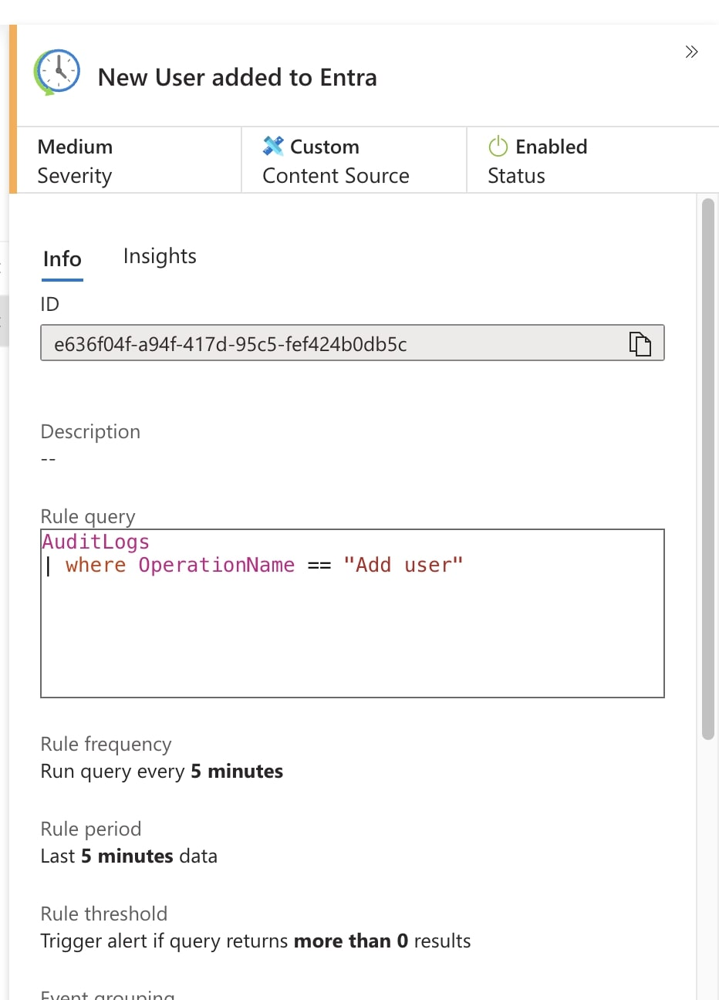
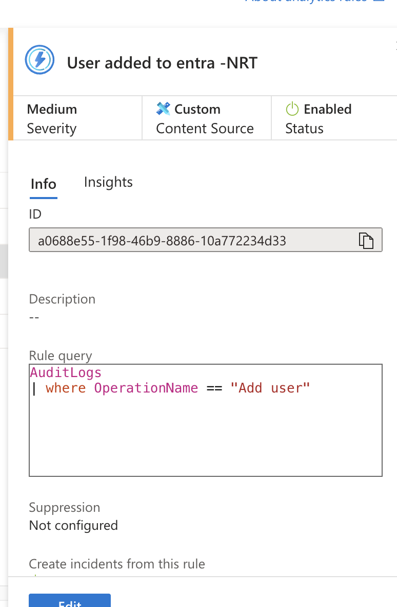

# Detection Rules Implementation in Azure Sentinel

## 1. Custom Scheduled Analytics Rules
Developed custom **scheduled rules** to trigger incidents upon log ingestion, ensuring timely threat detection.

## 2. Near-Real-Time (NRT) Analytics Rules
Implemented **NRT rules** to facilitate rapid response to security events by running queries every minute, significantly reducing detection latency.

## 3. Machine Learning-Based Detection Rules
Integrated **machine learning models** to identify anomalous RDP and SSH login activities, enhancing the detection of sophisticated threats.

---

**References:**  
- [Create scheduled analytics rules in Microsoft Sentinel](https://learn.microsoft.com/en-us/azure/sentinel/create-analytics-rules)  
- [Work with near-real-time (NRT) detection analytics rules in Microsoft Sentinel](https://learn.microsoft.com/en-us/azure/sentinel/create-nrt-rules)  
- [Threat detection in Microsoft Sentinel](https://learn.microsoft.com/en-us/azure/sentinel/threat-detection)
