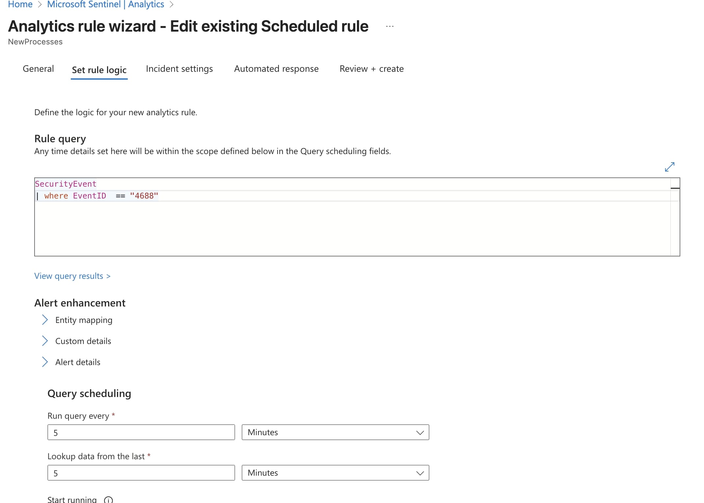

Added some custom scheudled rules to trigger incidents when logs are ingested and ensured that these rules were being triggered properly

After making some custom scheduled rules you can also make custom nrt rules to ensure quicker response

Added two machine learning rules to detect anamlous rdp and ssh logins

