Prerequisite
  - Create an azure acccount
  - Have access to a computer
 
Setup your resource group and link it to Microsoft Sentinal
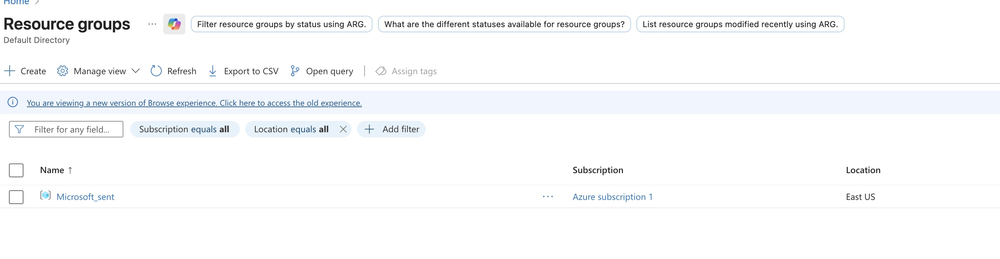

Once Sentinal is up and running add teh azure activity connection to monitor activity on azure and also add the Taxii threat intelligence connection.
I used PulseDive below to ingest threat intelligence into Sentinal
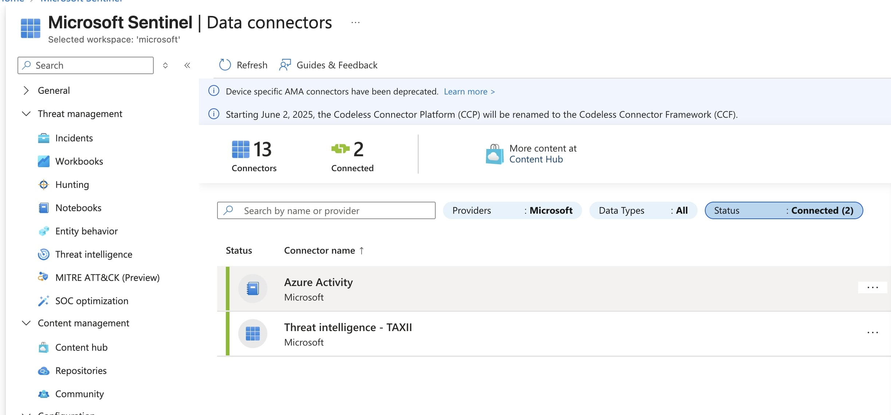
Make sure your threat intelligence and azure activity logs are coming in
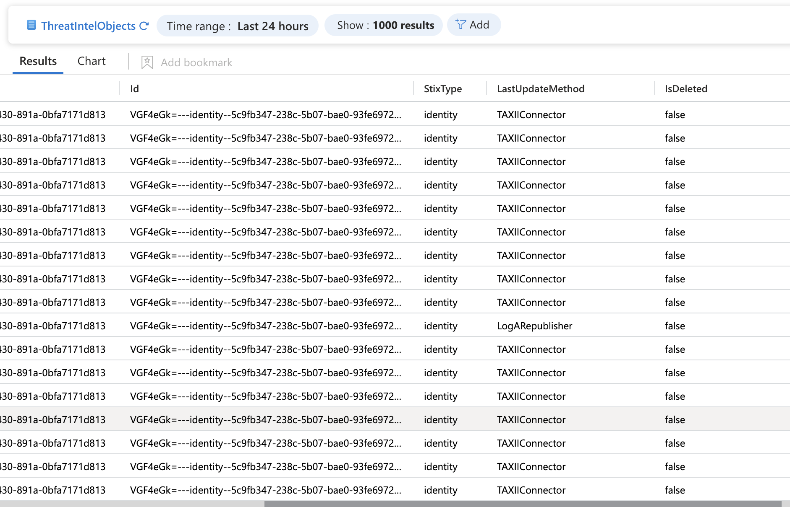
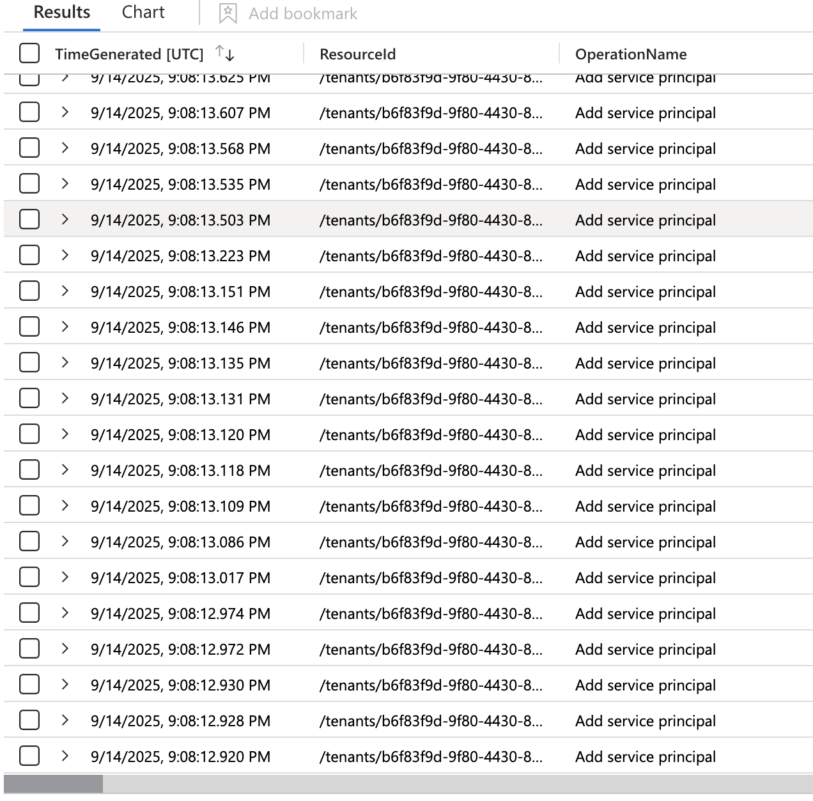
Next download the entra id connector and add a user to the domain and ensure the action is ingested into the logs
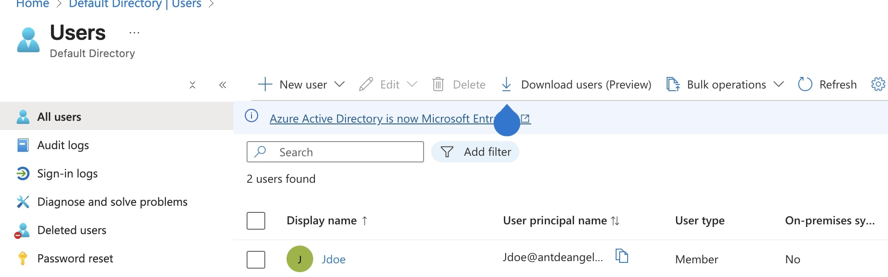
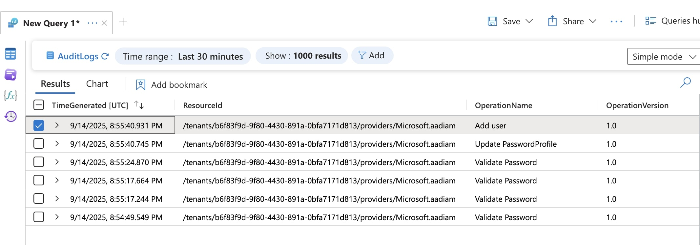
Added a vm into the resource group and enabled the windows security event connector to monitor the vm and than ensure the logs are being ingested
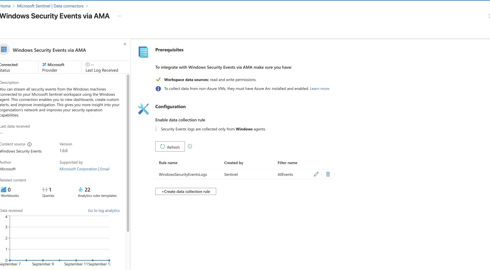
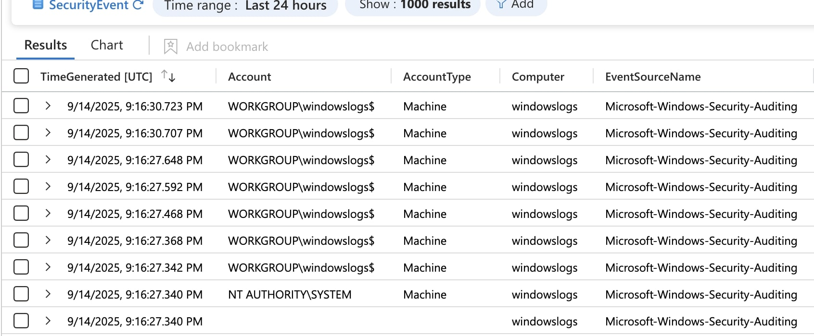
Added some custom scheudled rules to trigger incidents when logs are ingested and ensured that these rules were being triggered properly
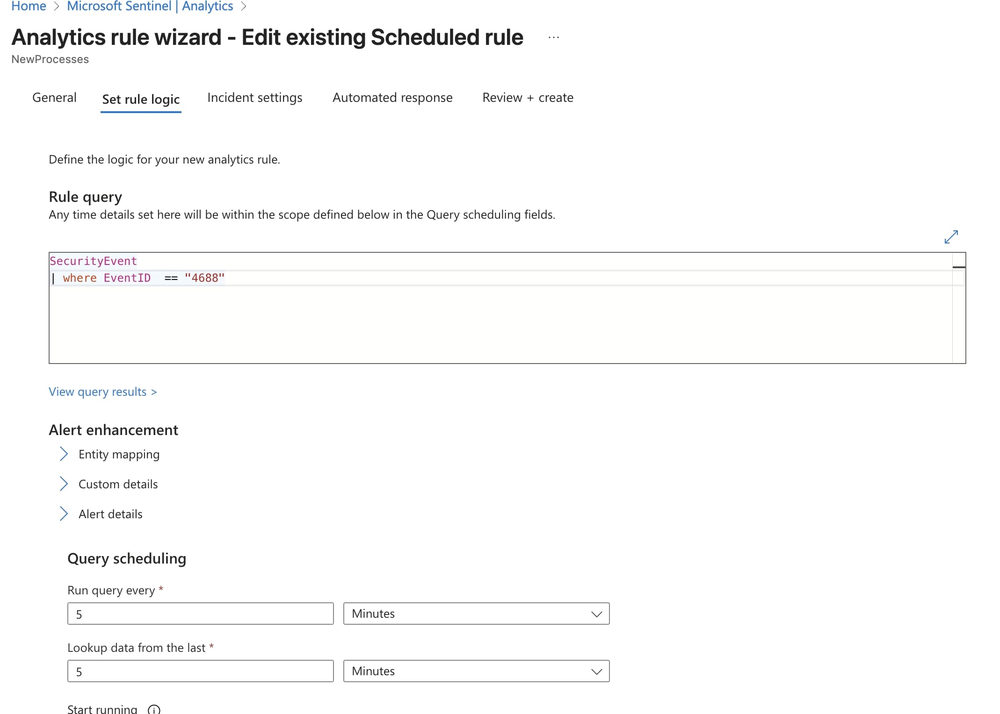

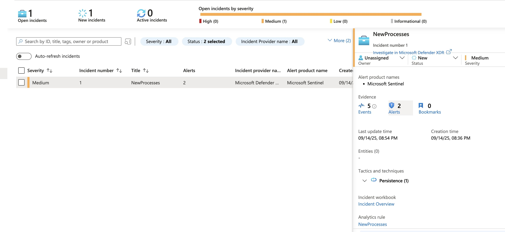

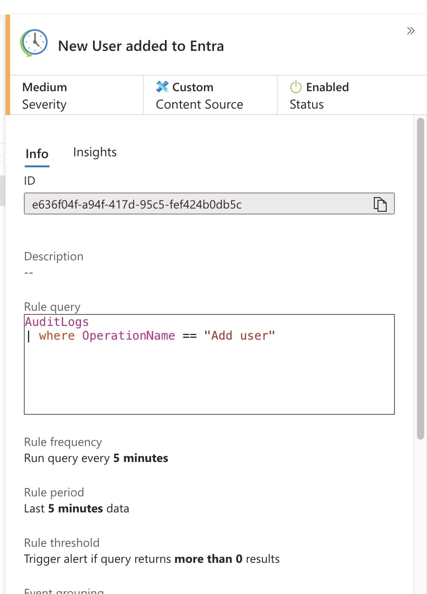

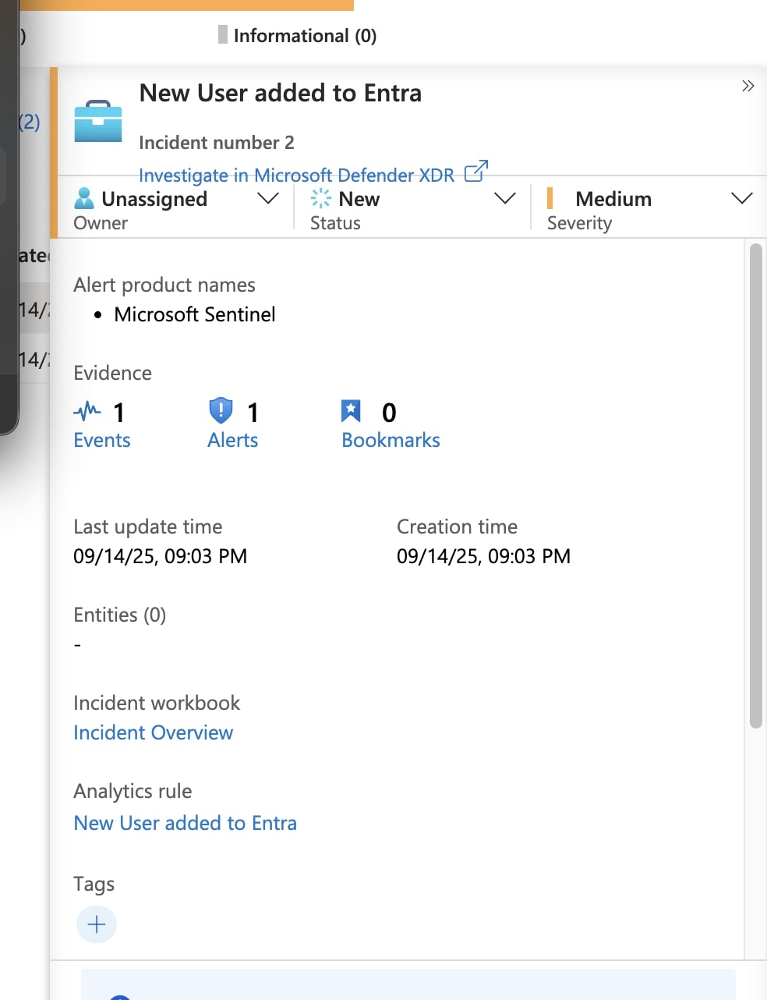
After making some custom scheduled rules you can also make custom nrt rules to ensure quicker response

Added two machine learning rules to detect anamlous rdp and ssh logins

