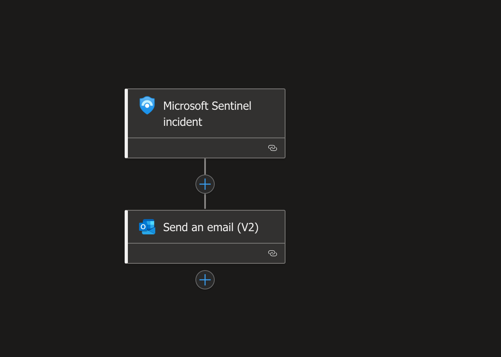
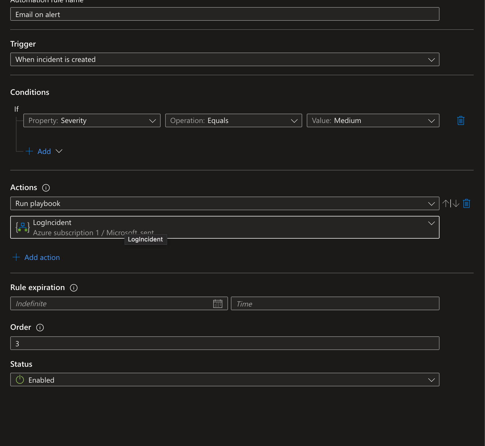
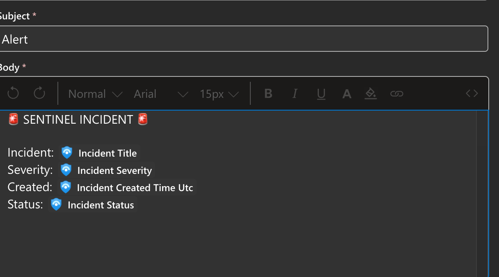

Create a playbook that takes the incident information and sends a email contaning it 
  

Create a automation rule that will trigger the playbook
  

Set up the playbook 
  

Make sure the right info was ingested in the email
  
