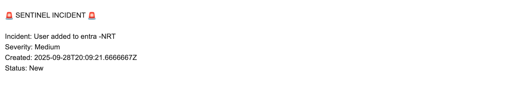

# Sentinel Playbook Email Setup

## 1. Create a Playbook  
Create a playbook that takes the incident information and sends an email containing it.  

## 2. Create an Automation Rule  
Create an automation rule that will trigger the playbook.  

## 3. Set Up the Playbook  
Configure the playbook to capture and send the incident details.  

## 4. Verify the Email  
Make sure the correct information is included in the email.  

