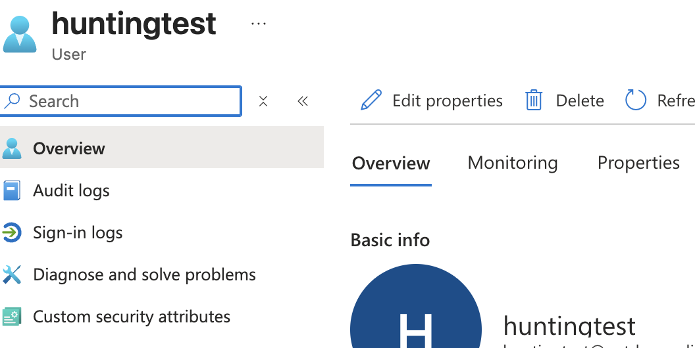

Added the **Entra ID** connector and created a hunt to detect user creation and deletion events.

I built **two KQL queries** for the hunt:  
* **New User Detected**  
* **User Deleted**

  

To validate the queries, I **created and then deleted a test user** in Entra ID.

  
  

Confirmed that both queries returned the expected results:

  
  

