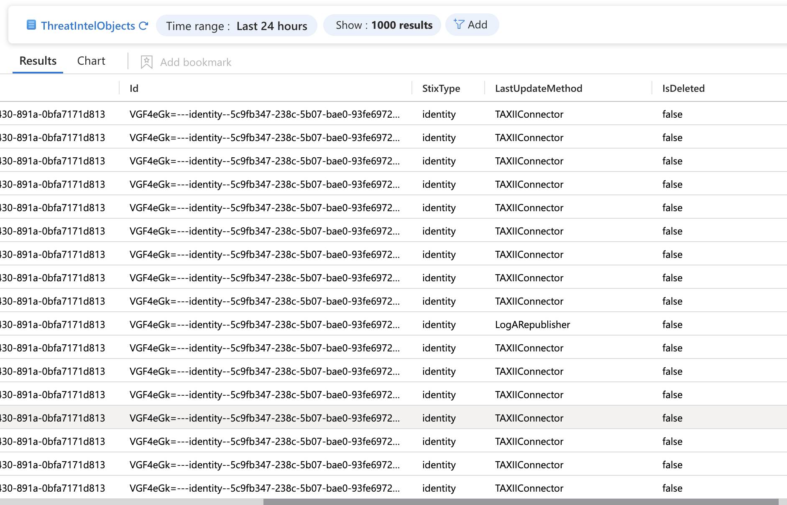
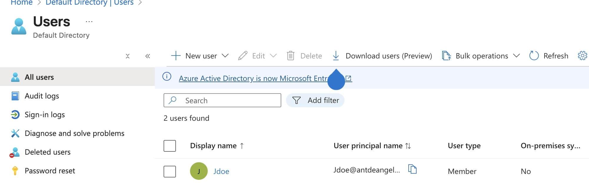
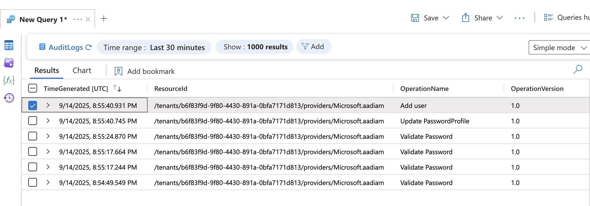

## Threat Intelligence and Azure Activity Integration

Once Sentinel is up and running, add the **Azure Activity** connection to monitor activity on Azure. Also add the **TAXII Threat Intelligence** connection.  

I used **PulseDive** below to ingest threat intelligence into Sentinel:

  

Make sure your **threat intelligence** and **Azure activity logs** are coming in:

  
  

Next, download the **Entra ID connector**, add a user to the domain, and ensure the action is ingested into the logs:

  
  

