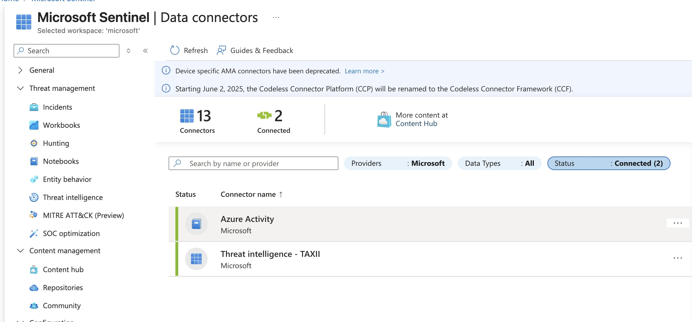

Once Sentinal is up and running add teh azure activity connection to monitor activity on azure and also add the Taxii threat intelligence connection.
I used PulseDive below to ingest threat intelligence into Sentinal

Make sure your threat intelligence and azure activity logs are coming in

Next download the entra id connector and add a user to the domain and ensure the action is ingested into the logs

